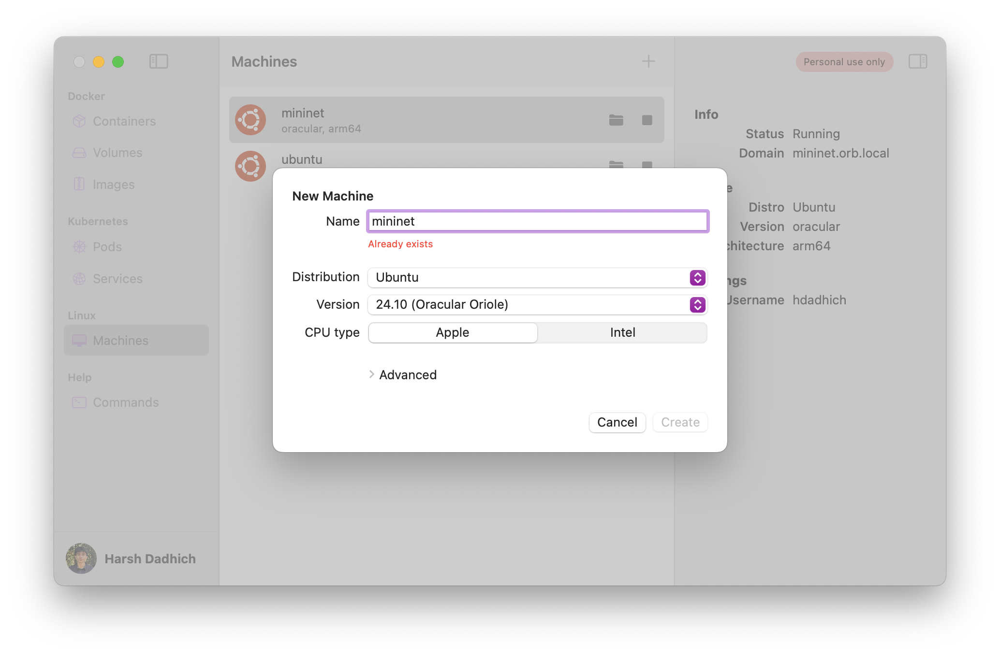

Set up a fast + light VM using OrbStack with **Mininet** + **Wireshark**

- Works on **Apple Silicon** (M1...)
- no **UTM**/**Multipass** needed
- GUI + bidirectional clipboard
- setup in ~10m, <2GB storage

## Install XQuartz and OrbStack

- Install XQuartz (GUI): [xquartz.org](https://www.xquartz.org/)
- Install OrbStack (VM): [orbstack.dev](https://orbstack.dev)

## Create the OrbStack Instance



## Connect to the Instance

Either `ssh mininet@orb` from a terminal or double-click **mininet** in OrbStack

## Installation

Inside the VM, run this:

**Note**: Please select yes on purple screen prompt

```bash
sudo apt install openssh-server xauth x11-apps -y
sudo apt install mininet traceroute wireshark -y
sudo apt install openvswitch-testcontroller dnsutils -y
sudo apt install chromium firefox ncsd -y
sudo usermod -aG wireshark $(whoami)
```

**What is this doing?**

- `openssh-server`: Enables remote SSH access
- `xauth`: Manages X11 forwarding auth
- `x11-apps`: Provides basic X11 GUI tools
- `mininet`: Simulates virtual networks
- `traceroute`: Traces route packets to destination
- `wireshark`: Captures and analyzes network traffic
- `openvswitch-testcontroller`: OpenFlow controller
- `dnsutils`: DNS utilities
- `chromium`: Chromium browser
- `firefox`: Firefox browser
- `ncsd`: Grants browsers access to the internet
- `usermod ...`: Grants user to capture packets

## GUI Setup

Still in the VM, run this:

```bash
sudo vim /etc/ssh/sshd_config
```

This brings up config, find and ensure these lines are set like this:

helpful: `i` to edit, `:wq` to save + exit, `:q!` to force quit without save if you mess up

```plaintext
X11Forwarding yes
X11DisplayOffset 10
X11UseLocalhost yes
```

Now saved, let's reload:

```bash
sudo systemctl restart ssh
```

Let's set a password (anything is fine, just remember it):

```bash
sudo passwd $USER
```

Let's also allow Chrome to use the GUI:

```
echo 'export XAUTHORITY=$HOME/.Xauthority' >> $HOME/.profile
```

## Connect to the VM with GUI

Pretty much done atp, let's connect!

**Important**: Close the VM's terminal tab, and open a new one (MacOS, not VM)

### **Quick Option**

Connect with X11 (`-X`) forwarding):

```bash
ssh -X mininet.orb.local
```

### **Better Option**

1. Edit SSH config:

```bash
vim ~/.ssh/config
```

2. Add (make sure to add your username):

```
Host mininet
    HostName mininet.orb.local
    User <your-username>
    ForwardX11 yes
```

3. Connect!

```bash
ssh mininet
```

## Usage

### **Run Commands**

Run wireshark (in background):

```bash
wireshark &
```

Run browser (in background):

```bash
# FF seems to run faster
# but included both since
# CSE 150 lab docs use chromium

chromium &
# or
firefox &
```

Run mininet scripts:

```bash
sudo python3 <script_name>.py
```

Also if you re-run mininet script and get an error, try wiping env:

```
sudo mn -c
```

Also note, bidirectional clipboard is supported! Make sure to use the <kbd>Control</kbd> instead of <kbd>Command</kbd> on the GUI to copy/paste.

### **Edit Python Files in VSCode**

Below stuff is optional, it's just to edit stuff in VSCode

1. Install [Remote - SSH](https://marketplace.visualstudio.com/items?itemName=ms-vscode-remote.remote-ssh).
2. Open VSCode, click TV icon on left sidebar **or** bottom & left-most icon
   1. Connect to Host
   2. Add New SSH Host
   3. `ssh mininet@orb`
3. Cmd+Shift+P, type in "Install code PATH" and enter
4. Now just open up a fresh terminal
5. Do as you please, use `code <filepath>` to open stuff in VSCode
